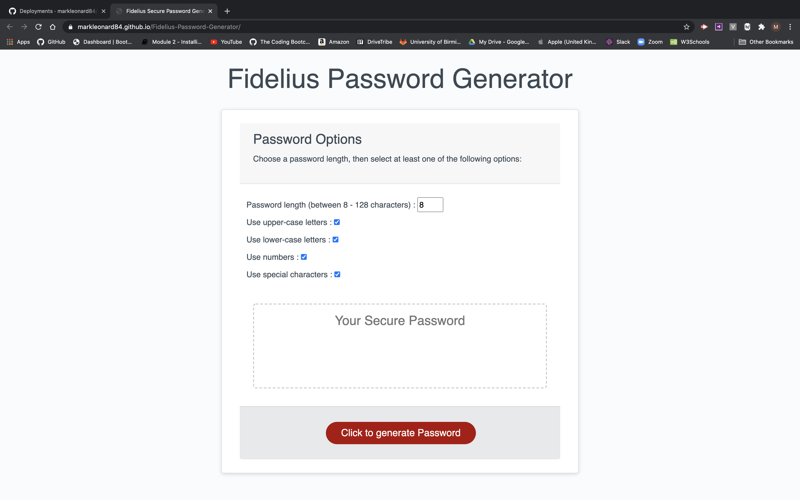

# Fidelius Secure Password Generator.

## Objective.
---
To create an application that will generate a secure password given a specified critera. 

* The password must be between 8 and 128 characters in length.
* The password must include options for lowercase / uppercase / numerical / special characters.
* The application should be easy to navigate and intuitive.
* The appication should have a clean and polished user interface.

## Application Website.
---
You can access the application at https://markleonard84.github.io/Fidelius-Password-Generator/

This application was written using Visual Studio Code.

